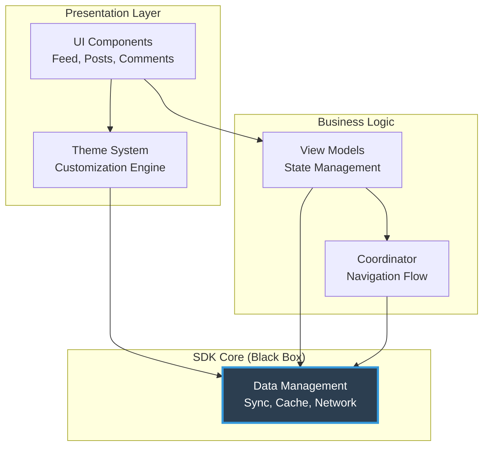

---
layout: ../../layouts/BaseLayout.astro
title: Social Feed SDK
---

## Problem

Multiple client applications needed social feed functionality, but each implementation required building the entire UI layer from scratch. This led to:
- Inconsistent user experiences across apps
- Months of development time per integration
- Difficulty maintaining unique brand identities
- Duplicate efforts solving the same UI challenges

## Solution

Designed a **UI-first Feed SDK** with a flexible architecture that provides complete social feed functionality while allowing apps to maintain their unique design language through a comprehensive customization system.

### High-Level Architecture



## Architectural Design

### Layer 1: Presentation Layer

**UI Components**
- Pre-built, production-ready views for all feed interactions
- Modular design allows selective usage or complete replacement
- Protocol-based architecture enables custom implementations

**Theme System**
- Centralized customization engine
- Cascading style properties
- Runtime theme switching support

### Layer 2: Business Logic

**View Models**
- MVVM pattern for clear separation of concerns
- Reactive state management
- Handles all UI state and business rules

**Coordinator Pattern**
- Manages navigation flows
- Decouples view controllers
- Enables custom navigation patterns

### Layer 3: SDK Core (Black Box)

Handles all data concerns invisibly:
- Network communication
- Local persistence
- Offline sync
- Cache management

## Customization Architecture

### Three-Tier Customization System

**Tier 1: Theme-Level Customization**
```swift
// Override visual properties globally
SDK.setTheme(
    colors: CustomColorScheme,
    typography: CustomFonts,
    spacing: CustomSpacing
)
```
- Affects all UI components instantly
- Maintains consistency across the SDK
- 100+ themeable properties

**Tier 2: Component-Level Customization**
```swift
// Configure individual component behavior
feedViewController.configure(
    layout: .compact,
    actionBarPosition: .bottom,
    mediaDisplayStyle: .aspectFill
)
```
- Fine-grained control per component
- Multiple layout variants
- Behavioral customization

**Tier 3: Implementation-Level Customization**
```swift
// Replace entire components
class CustomPostCell: FeedPostCell {
    // Your custom implementation
}

feedViewController.registerCell(CustomPostCell.self)
```
- Complete component replacement
- Full UI control when needed
- Inherit data binding from SDK

## Architecture & Customization

### Protocol-Oriented Design

**Core Patterns:**
- **Composition over inheritance** - Flexible, testable architecture
- **Key protocols**: `FeedViewConfigurable`, `ThemeProvider`, `PostCellRenderable`, `ActionHandler`
- **Swappable implementations** - Easy mocking and customization

**MVVM Architecture:**
- Views handle presentation only
- ViewModels manage state and business logic
- Clear data flow enables easy customization
- Testable, reusable components

**Coordinator Pattern:**
- Decoupled navigation flow
- Centralized routing control
- Custom navigation and deep linking support

### Customization Capabilities

**Visual Theming:**
- Complete color system (primary, secondary, surfaces, text hierarchy)
- Typography scale with 6 customizable text levels
- Spacing system and layout properties
- Runtime theme switching with smooth transitions
- Dark mode and per-screen overrides

**Behavioral Configuration:**
- Custom gestures and animations
- Configurable loading states and error flows
- Layout variants (compact, standard, expanded)
- Media display modes and action arrangements

**Component Replacement:**
- Swap entire view controllers or individual cells
- Replace media viewers, input editors, action sheets
- SDK handles all data binding automatically
- Custom components inherit data layer functionality

## Integration Example

```swift
// 1. Configure SDK
SDK.configure(apiKey: "YOUR_KEY")

// 2. Apply theme
SDK.setTheme(customTheme)

// 3. Present feed
let feed = FeedViewController()
feed.configure(layout: .compact)
present(feed, animated: true)

// Optional: Replace components
feed.registerCell(CustomPostCell.self)
```

## Results

**Developer Experience:**
- 3-line basic integration
- Hours instead of months for custom feeds
- 90% reduction in UI development time

**Flexibility:**
- 5+ apps with completely different looks
- Each maintains brand identity
- Shared SDK provides consistency in behavior

**Performance:**
- 60fps smooth scrolling
- Instant theme switching
- Efficient cell reuse
- Memory-optimized rendering

## Technical Challenges Solved

**Challenge 1: Flexibility vs Simplicity**
- Solution: Three-tier customization system - start simple, go deep when needed

**Challenge 2: Diverse Design Systems**
- Solution: Comprehensive theme engine that adapts to any design language

**Challenge 3: Component Coupling**
- Solution: Protocol-oriented architecture with dependency injection

**Challenge 4: State Management**
- Solution: MVVM pattern with reactive view models

## Trade-offs

**Bundle Size vs Features**
- Comprehensive UI components increase size
- Worth it: Eliminates months of development

**Customization Depth vs API Complexity**
- Many customization points add complexity
- Mitigated: Progressive disclosure with sensible defaults

## Key Learnings

**Architecture Matters**
- Clean separation of concerns enables customization
- Protocol-oriented design provides maximum flexibility
- Coordinator pattern simplifies navigation customization

**Theme System Design**
- Apps prioritize matching their design system
- Complete customization > partial control
- Runtime theme switching is crucial

**Developer Experience**
- Simple default case is critical
- Power users need deep customization
- Documentation should show both paths

**Component Design**
- Small, focused components compose better
- Data binding should be invisible
- Replace entire component > many properties

[← Back to Projects](/projects)
