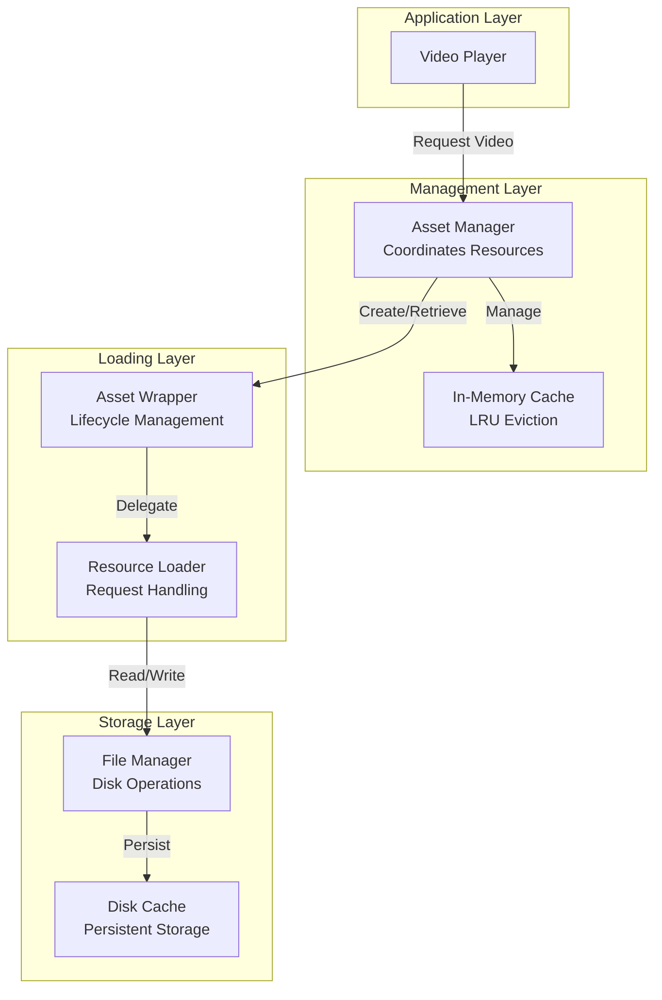
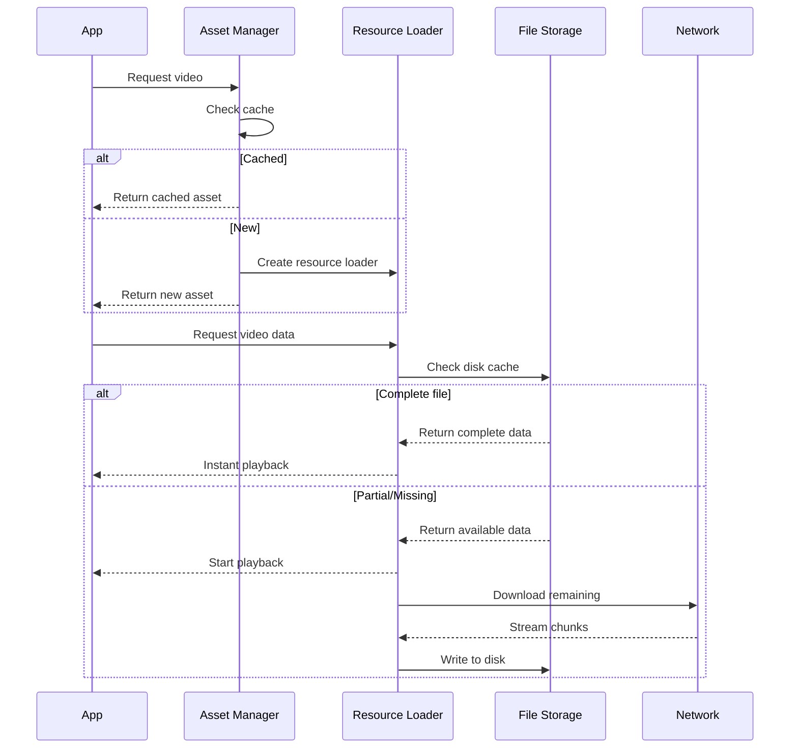

---
layout: ../../layouts/BaseLayout.astro
title: Video Caching System
---

## Problem

Video-heavy surfaces in the app consumed excessive bandwidth and caused long load times. Users experienced:
- Repeated downloads of the same content
- High data consumption
- Stuttering during rapid scroll
- Long initial buffering times

## Solution

Designed and implemented a production video caching framework that intelligently manages video assets with progressive downloading and smart caching.

### High-Level Architecture

### Key Features

**Two-Tier Caching**
- In-memory cache for instant access to active videos
- Disk-based cache for persistent storage across sessions
- LRU (Least Recently Used) eviction strategy

**Progressive Streaming**
- Videos start playing before complete download
- HTTP Range request support for partial downloads
- Smart resumption of interrupted downloads

**Thread-Safe Operations**
- Modern concurrency model prevents data races
- No manual locking mechanisms needed
- Compiler-enforced isolation between components

**Memory Management**
- Automatic cache clearing on memory pressure
- Configurable size limits for both tiers
- Device-aware optimization strategies

### Data Flow

## Technical Approach

### Concurrency Model

Built using modern Swift concurrency patterns:
- Actor-based isolation for shared state
- Async/await for asynchronous operations
- Structured concurrency for task management
- Compile-time safety guarantees

### File System Management

Implemented robust disk I/O handling:
- Per-file write queues prevent corruption
- Atomic operations for file moves
- Automatic cleanup of partial downloads
- Size-based cache eviction

### Network Optimization

Smart downloading strategy:
- HTTP Range requests for resumable downloads
- Partial content utilization
- Bandwidth-aware streaming
- Background download continuation

## Configuration

The system provides configurable parameters for:
- Maximum disk cache size
- In-memory asset limits
- Custom cache location providers
- Data usage tracking delegates

## Results

**Performance Improvements:**
- Instant playback for cached videos
- Progressive streaming for new content
- Reduced bandwidth consumption
- Smooth scrolling experience

**Reliability:**
- Zero data races in production
- No file corruption issues
- Handles memory pressure gracefully
- Stable under concurrent access

**User Experience:**
- Faster video load times
- Reduced data usage
- Better performance on slow networks
- Seamless offline-to-online transitions

## Technical Challenges Solved

**Challenge 1: Thread Safety**
- Problem: Concurrent access to shared resources
- Solution: Actor-based isolation with compiler guarantees

**Challenge 2: File Corruption**
- Problem: Multiple writes to same file
- Solution: Sequential task queues per file

**Challenge 3: Memory Management**
- Problem: Unbounded cache growth
- Solution: LRU eviction with device-aware limits

**Challenge 4: Partial Downloads**
- Problem: Interrupted downloads wasted bandwidth
- Solution: HTTP Range requests with smart resumption

## Trade-offs

**Complexity vs Reliability**
- Invested in custom resource loading logic
- Multiple coordinated components
- Worth it: Production-stable with zero corruption

**Storage vs Performance**
- Uses disk space for persistent cache
- Trade-off: Significantly faster subsequent loads
- Configurable limits balance both concerns

## Technical Stack

- Swift with modern concurrency
- AVFoundation framework
- Custom resource loading
- URLSession for networking
- Swift Package Manager

[← Back to Projects](/projects)
